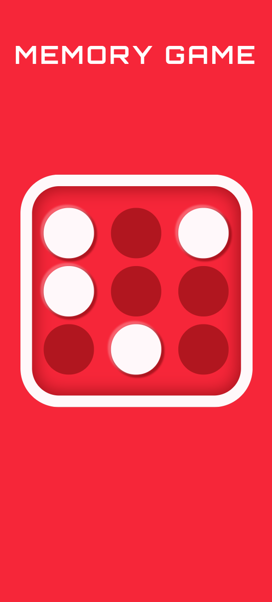

<h1 align="center">
    
</h1>
<h1 align="center">
    
</h1>
<h1 align="center">
    
</h1>

## 💻 About project

Game project made using HTML5, CSS3 and JS. It is a personal project about a memory game, which sets a sequence of random cubes, then you have to memorize it and click over the cubes in the same sequence it appeared. If you miss the sequence, it shows Game Over and a restart button, which reloads the application. Cool game to play and challenge your family during this quarantine.

## 🛠 Technology

#### **Website**

-   **[HTML5](https://developer.mozilla.org/pt-BR/docs/Web/HTML/HTML5)**
-   **[CSS3](https://www.w3schools.com/css/)**
-   **[Javascript](https://developer.mozilla.org/pt-BR/docs/Web/JavaScript)**

#### **Utilitaries**

-   Editor: **[Visual Studio Code](https://code.visualstudio.com/)**
-   Font: **[Orbitron](https://fonts.google.com/specimen/Orbitron)**

### Prerequisites

Before you begin, you will need to have the following tool installed on your machine:
[Git](https://git-scm.com)

In addition, it is good to have an editor to work with the code as **[VSCode](https://code.visualstudio.com/)**

### Running the web application (Front End)

```bash
# Clone this repository
$ git clone https://github.com/luizmr/memory-game-app.git

# Access the project folder in the cmd/terminal
$ cd memory-game-app

# Install http-server or Live Server
$ npx http-server

# Now you just have to run the application using one of the previous options
```

Made with ❤️ by Luiz Marcelo Rocha
